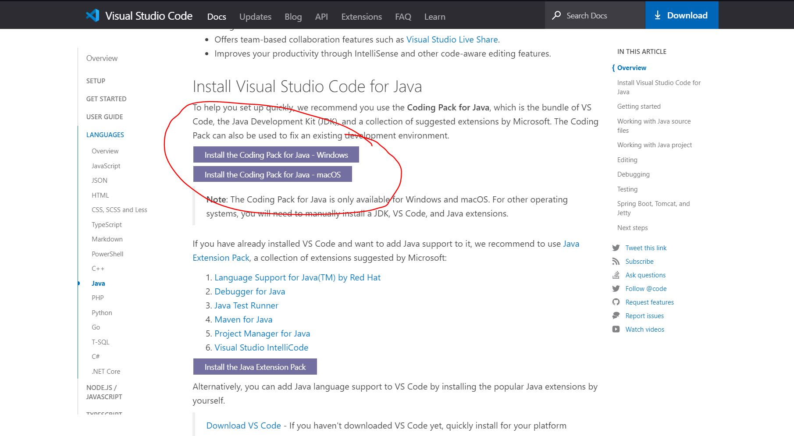

# Tecnicas de graficacion

Este es el portafolio de la materia de graficacion en la cual empleo diferentes tecnicas de graficacion computacional a travez del lenguaje de java

Para correr estos programas utiliza visual studio code y el entorno de desarrollo que se puede encontrar aqui:

https://code.visualstudio.com/docs/languages/java

